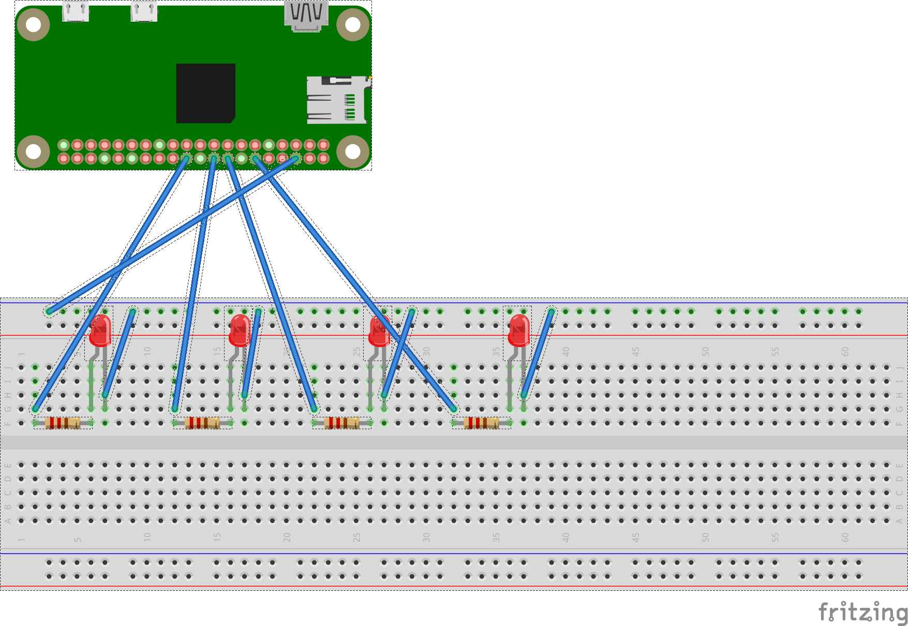

# Project Cocktailmachine

## How to Run

* install python3.8
    * debian/ubuntu: `apt-get install python3.8`

* clone project
    * `git clone https://github.com/yanehi/raspberrypi-cocktailmachine.git`

* create `virtualenv` for your project dependencies

* install dependencies

    * `pip install -r requirements.txt`

* start the backend
    * `uvicorn main:app --reload`

## Backend

For the access of the GPIOs from the raspberry we use [RPi.GPIO](https://pypi.org/project/RPi.GPIO/).
We use the GPIOS: 18, 23, 24, 25.

## API

For the REST API we use [FastAPI](https://fastapi.tiangolo.com/)

## Commit Guide and Branching

* we use the [Angular commit guide](https://github.com/angular/angular/blob/master/CONTRIBUTING.md).
* branch names: <issue-number>-issue-name

## Styleguide
* [flake8](https://flake8.pycqa.org/en/latest/)

## RaspberryPi Zero Setup

Prepare your RaspberryPi Zero with our [setup file](./Setup_pi.md).

## Contributors

* [Janosch Fischer](https://github.com/janosch09)
* [Yannic Nevado](https://github.com/yanehi)

